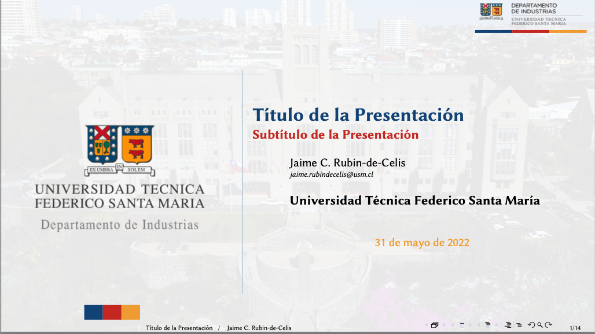

# Plantilla (beamer) UTFSM
Plantilla para *beamer* que sigue las instrucciones del manual corporativo de la Universidad Técnica Federico Santa María (Chile) ([www.usm.cl](http://www.usm.cl)).



## Uso

Simplemente ajuste los parámetros para la portada del archivo `beamer.tex` y edite el archivo `frames.tex` que contiene las transparencias (*frames*).

Para compilar la bibliografía, recuerde

```zsh
$ pdflatex beamer & bibtex beamer & pdflatex beamer & pdflatex beamer

```

## Licencia
El uso esta permitido bajo la licencia [*MIT*](https://opensource.org/licenses/MIT). (Significa que puede ocuparla/modificarla, pero debe mantener la referencia al autor.)

**Importante:** Se excluyen de esta licencia los archivos de imágenes. Todas las imágenes son propiedad intelectual de la UTFSM &copy;.

## Contribuciones
Por favor, directamente a través de un `pull request`.
